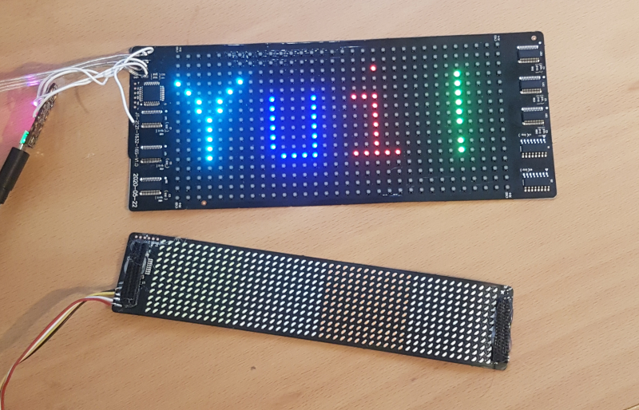
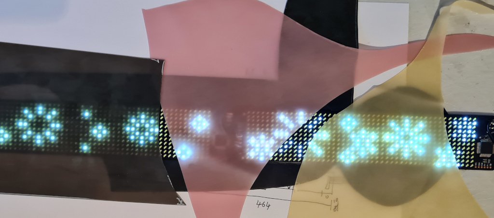
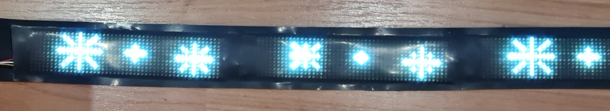

# Library to communicate with LED1248 flexible displays

Earlier this year I found a number of flexible LED matrix panels that I've been using in
my clothing and accessories. The panels communicate via bluetooth from
an Android app but I wanted to be able to sychronise multiple displays
and control them locally from a small Arduino without Bluetooth.

I wrote this library so you can communicate using your own code with
these displays. I've tested it with both a RGB display (32 pixels by
16 pixels by 7 colours) and the mini single colour
display (48 by 12 pixels).  Sometimes these single colour displays have blocks of
different colour LEDs so they look multicolour even though they are not.

[Download the release and import the Zip in the library manager](https://github.com/kigyui/LED1248/releases/)

There are a number of sellers of these displays on various
marketplaces, and they come and go quite often. You can usually figure
out if any given display will work with this library by looking at the app they ask
you to use. If the app is LED1248 (sometimes called COOLLED1248) it should work.
The boards are relatively
inexpensive (US$15-US$30) and are sold bare and as part of clothing,
hats, and even dog collars.  A good way to get one if you are in the
USA/Canada is from [Lumen Couture](https://www.wearabletutorials.com/buy-ultra-thin-led-matrix-panels/)

The displays come with a little dongle that provides power (3v from a
lithium battery) and communication to the flexible panel. The dongle doesn't do
much processing, it just provides the power on and off commands and
passes through any other commands recieved by its bluetooth
module. This means that via the serial interface you don't have
full addressable control of the LEDs but instead can do the same sorts
of things as the app does.  You can display some text (scrolling it if you
like), display a multi-frame animation, or do a music-style bargraph.

## How to use

Unplug the dongle from the board (sometimes they have connectors, sometimes not) and
connect the power (3v), ground, and TX pins to an arduino (I used a
Trinket M0 but anything should do as long as it runs at 3v, has
hardware serial pins and enough RAM for any animations or bitmaps you
want).  Do look at the label on the PCB for which pin is which and don't
trust the wire colours (one of the boards I received has the red wire
as 0v, black as 3v).

Note: This library doesn't use the RX pin and relies instead on timing for
knowing when to send the next command. Firstly this saves connections,
useful especially on wearables, but also the RX isn't actually UART
serial data so we'd have to parse it.

This library should also work communicating over Bluetooth to the
boards, but you need to batch the bytes you send into groups of 20
bytes max, and you will likely want to handle the return acknowledgements.
Pull Requests with patches welcomed!

By using the Adafruit GFX canvas library you can draw text and other
objects onto a canvas then push it to the board to display.

The included example displays a demo reel: a 5 frame animation with
some text, some scrolling text, and then a random bargraph display.

## Built versions

I joined three white displays together and slid them between two glued layers of latex
sheeting. The top layer was 0.5mm semi transparent black, the bottom 1.05mm black. LEDs
shine quite well through some latex, but you need to experiment to find colours that don't
affect the brightness or filter some of the colours too much.

Testing the latex sheeting:

The final headband made from 3 LED matrix strips

